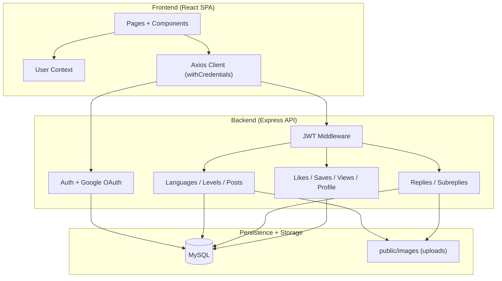

<div align="right">
<a target="_blank" href="https://www.linkedin.com/in/nagaraj-r-4265272b8/">
  
</a>
<a target="_blank" href="https://github.com/Nagaraj-06">
  
</a>
</div>

<div align="center">


<br/>

[](https://github.com/Nagaraj-06/Dicuss-Forum)
[](https://github.com/Nagaraj-06/Dicuss-Forum/commits/main)
[](https://github.com/Nagaraj-06/Dicuss-Forum/issues)
[](https://github.com/Nagaraj-06/Dicuss-Forum/pulls)

<br/>

<p>
  
  
  
</p>

<br/>

*A structured learning forum where students ask doubts, share answers, and collaborate across languages, levels, and topics.*

[🚀 **Live Demo**](https://project-omega-lime-69.vercel.app/)

</div>

<hr/>

## ⏩ Quick Links

- [📦 What is Included](#-what-is-included)
- [🔥 Key Features](#-key-features)
- [🛠️ Tech Stack](#️-tech-stack)
- [📐 Architecture Overview](#-architecture-overview)
- [⚙️ Setup & Installation](#️-setup--installation)
- [📂 Folder Structure](#-folder-structure)
- [🔮 Roadmap](#-roadmap)

<hr/>

## 📦 What is Included

**EduSphere** is a full-stack discussion forum focused on course-based learning.

- **🔐 Authentication Layer** - Email/session flow with JWT cookie handling and Google OAuth (`passport-google-oauth2`).
- **🧠 Forum Taxonomy** - Language -> Level -> Discussion hierarchy for organized discovery.
- **💬 Discussion Engine** - Create and edit posts, replies, and sub-replies with optional image uploads.
- **⭐ Interaction System** - Likes, saved posts/replies, views, and recent activity feeds.
- **👤 Profile Module** - User profile data, created topics, replies, favorites, and activity summaries.

---

## 🔥 Key Features

- **Course-oriented discussions** with language and level segmentation.
- **JWT-protected APIs** using cookie or bearer token validation.
- **Google sign-in flow** with Passport-based OAuth callback handling.
- **Nested conversations** via main replies and sub-replies.
- **Media support** for discussion/reply image uploads using Multer.
- **Engagement tooling** including likes, saved items, and view tracking.
- **Forum analytics** endpoints for total languages, levels, and posts.

---

## 🛠️ Tech Stack

### ⚙️ Core Technologies
| Frontend | Backend | Database | Authentication | Styling/UI |
| :---: | :---: | :---: | :---: | :---: |
| React 18, React Router | Node.js, Express | MySQL (`mysql2`) | JWT, Cookies, Google OAuth | CSS, MUI, BlueprintJS |

### 🛠️ Supporting Libraries
| Networking | Security | Uploads | Utilities |
| :---: | :---: | :---: | :---: |
| Axios | bcrypt, cookie-parser, express-session | Multer | dotenv, body-parser |

---

## 📐 Architecture Overview



---

## ⚙️ Setup & Installation

### Prerequisites
- Node.js `v18+`
- MySQL Server
- npm

### 1. Clone

```bash
git clone https://github.com/Nagaraj-06/Dicuss-Forum.git
cd Dicuss-Forum
```

### 2. Backend Setup

```bash
cd backend
npm install
```

Create `backend/.env` (see env section below), then run:

```bash
npm start
```

Backend runs on: `http://localhost:2000`

### 3. Frontend Setup

```bash
cd ../client
npm install
npm start
```

Frontend runs on: `http://localhost:4000`

---

## 📂 Folder Structure

```text
Dicuss-Forum/
├── backend/
│   ├── app.js
│   ├── passport-setup.js
│   ├── public/images/
│   └── src/
│       ├── config/
│       ├── middleware/
│       ├── Controllers/
│       └── Routes/
├── client/
│   ├── public/
│   └── src/
│       ├── Pages/
│       ├── Account_Pages/
│       ├── componants/
│       ├── api/
│       └── assets/
└── README.md
---

## 🔮 Roadmap

- [ ] Add test coverage for API routes and critical UI flows
- [ ] Add pagination and filters for large discussions
- [ ] Add role-based moderation (admin/moderator)
- [ ] Improve notification system for reply and mention events
- [ ] Add Docker compose for one-command local setup

---

<div align="center">

**Star this repo if it helped you.**

<br/>

[](https://github.com/Nagaraj-06)
[](https://www.linkedin.com/in/nagaraj-r-4265272b8/)

<br/>

*Built by Nagaraj R*


</div>
